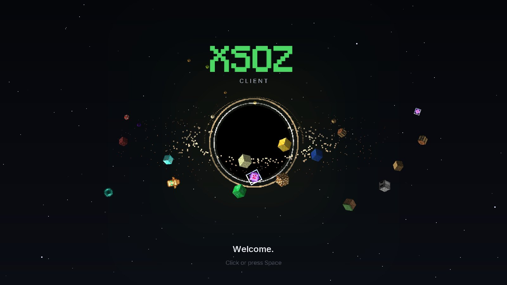
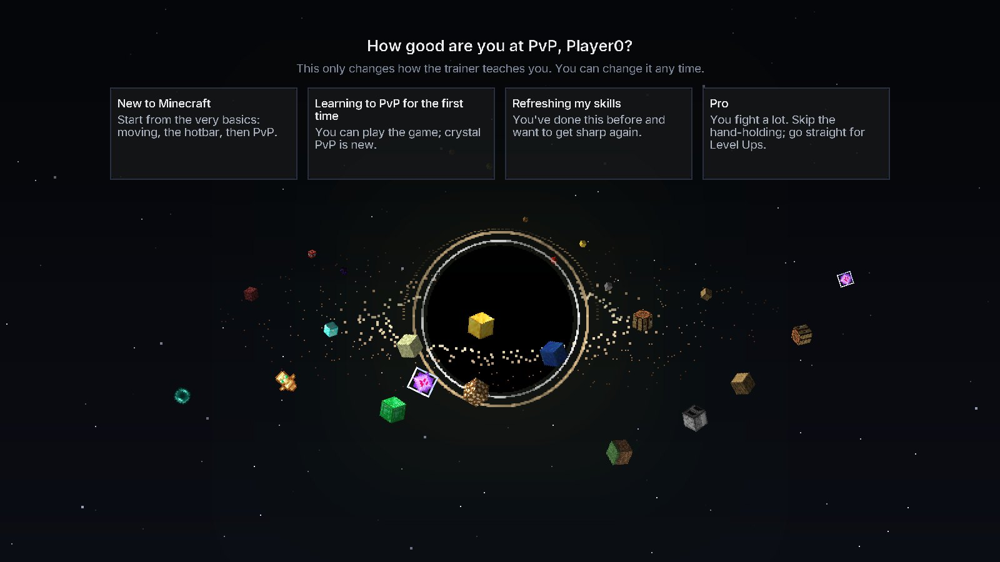

# Xsoz Client

**The Minecraft PvP client that actually teaches you to fight.**

Slow-motion tutorials with your own keys on screen. Drills that train one skill at a time.
Bots that play by a real player's rules. All inside Minecraft 1.21.11.

&nbsp;

&nbsp;

&nbsp;

---

## What is it?

Xsoz Client is a mod for Minecraft: Java Edition that turns the game into a PvP training ground.
Instead of just giving you features, it **shows you how to do things, lets you try them, and tells
you what to fix**. It's made for Crystal PvP first, with Sword PvP too.

| | |
|---|---|
| 🎓 **Learn** | Short lessons in plain words: placing crystals, getting your totem back, holes, anchors, pearls, crits, W-taps, shields. |
| ▶️ **Tutorials** | The game slows down, your own keys light up as each one is "pressed", it pauses to explain, then you try it yourself. |
| 🎯 **Training** | Drills that train one skill each, with 3 levels and a Level Up test. Pass them to climb the ranks. |
| 🤖 **Free Roam** | Fight bots as long as you like, from Beginner to Godlike (and a Hacker mode that cheats). |
| 📊 **Fight reports** | Every fight gets a grade, with what went wrong and which drill fixes it. |
| 🛠️ **Mods** | Hide explosion particles, zoom, toggle sprint, a cleaner crosshair, a HUD editor and more. |

---

## 🎓 Tutorials that slow the game down

Pick a lesson with a ▶ and press **Watch and try**. Everything slows down, a caption tells you
what's happening, and the keys you'd press light up on screen. At the important moment the world
stops so you can read why it works. Then the scene resets and it's your turn.

  
  

  

Tutorials: placing and breaking a crystal · getting your totem back · surrounding · anchors ·
anchor double tap · crystal double tap · hit crystal · critical hits · W-tapping · breaking shields.

---

## 📚 Lessons in plain words

No jargon walls. Every PvP word is explained the first time it shows up.

  

---

## 🤖 Bots that fight like players

Bots in Free Roam follow the same rules you do: they only click blocks they can see, reach 4.5
blocks for blocks and 3 for hits, sprint only when moving forward, and look where they're going.
Good ones follow your pearls when they see them. Each one has a personality: some love anchors,
some rush you, some sit in holes.

  
  

- **Mix any weapons**: Crystals, Anchors, Sword, Axe + shield, Mace, Elytra
- **10 maps**: Stone, Grass, Craters, Hills, Ruins, Obsidian, Desert, Birch forest, Snowy taiga, Nether
- **Real ground**: a thin floor in the sky, deep ground with ores, or a full world down to bedrock
- **Teams**: free for all, bots vs you, or bots on your team
- **Levels**: all the same, mixed, or *Adaptive* (better when you win, easier when you lose)
- **Watch mode**: fly around and watch the bots fight, or click one to see through its eyes

---

## ✨ A proper first launch

The first time you open it, a black hole forms while *Sweden* plays. It asks your name and how good
you are, offers a one-minute tour, then dives you into the main menu.

  
  

---

## ⬇️ Install

1. Download **`Xsoz Client Setup.exe`** from the [latest release](../../releases/latest).
2. Run it. Windows may show *"Windows protected your PC"* because the file isn't code-signed.
   Click **More info**, then **Run anyway**.
3. The installer finds your `.minecraft` folder (or asks you to pick it). Press **Install**.
4. Open the official **Minecraft Launcher**. Next to the green **PLAY** button, choose
   **Xsoz Client** from the version list and press **PLAY**.

You need Minecraft: Java Edition and the official Minecraft Launcher. Xsoz Client lives in its own
folder: your worlds, mods and other versions are not touched. Training drills run in your own
single-player worlds and put everything back exactly as it was when you stop.

---

## 🔧 Building from source

- **The mod**: `./gradlew :platform-1.21.11:build` (Gradle needs JDK 25)
- **The installer**: `dotnet publish launcher/src/Xsoz.Launcher/Xsoz.Launcher.csproj -c Release`
  (.NET 10, Windows)

---

Not an official Minecraft product. Not approved by or associated with Mojang or Microsoft.

