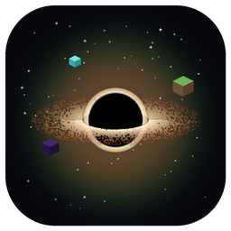
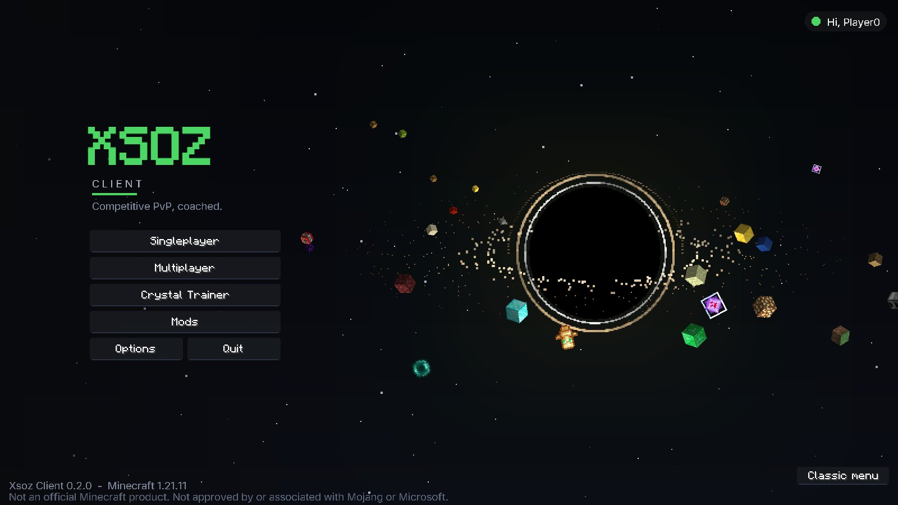
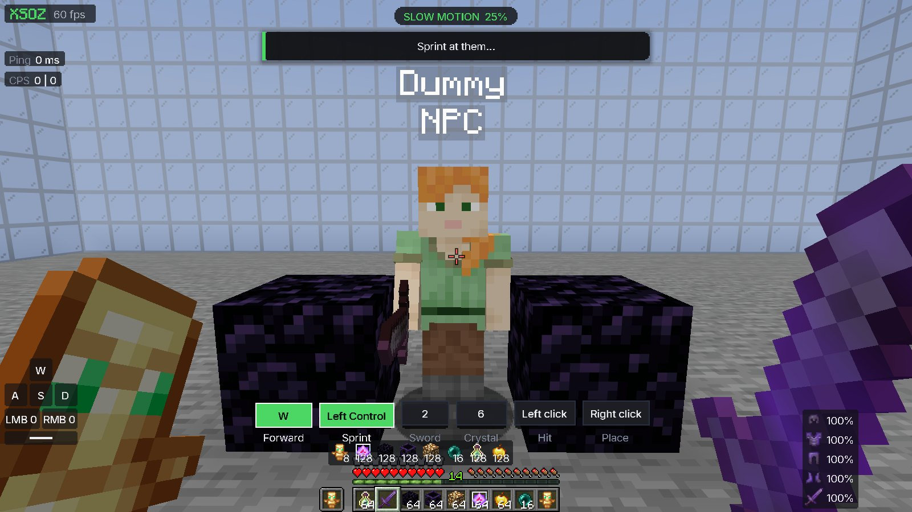
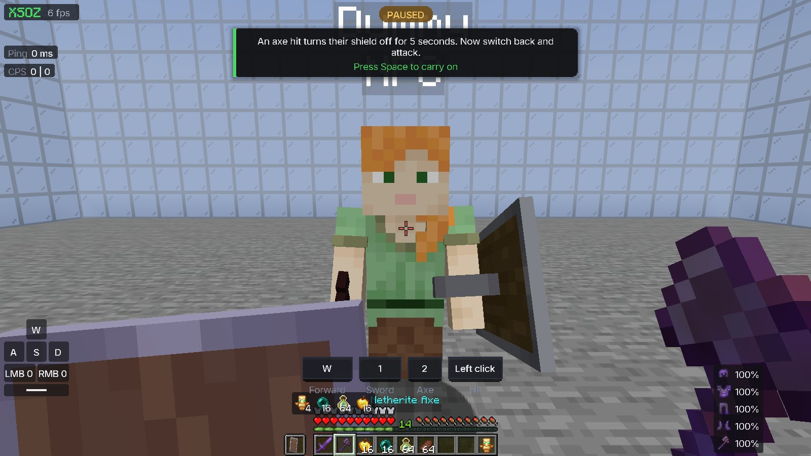
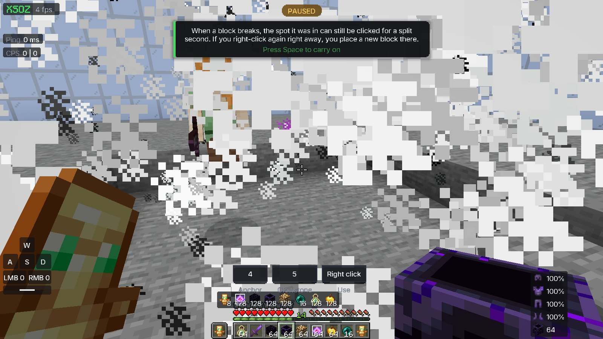
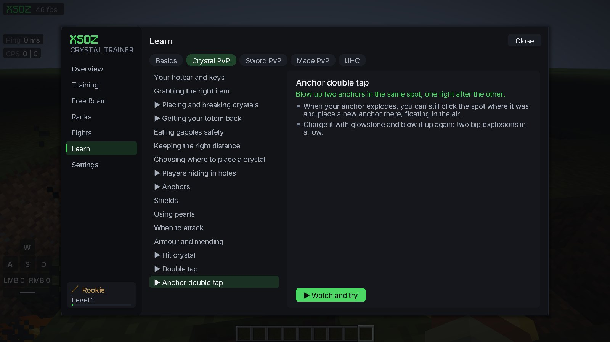
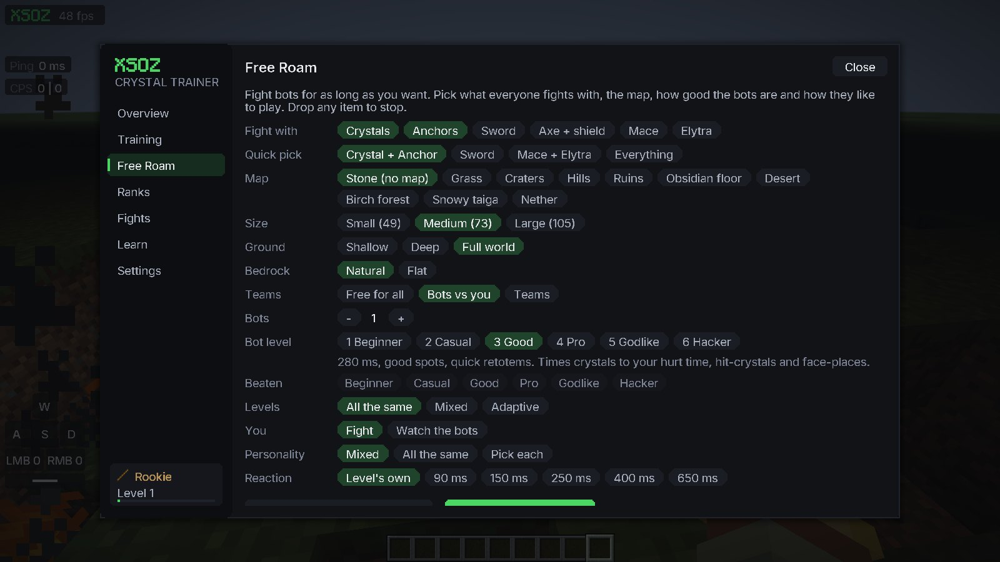
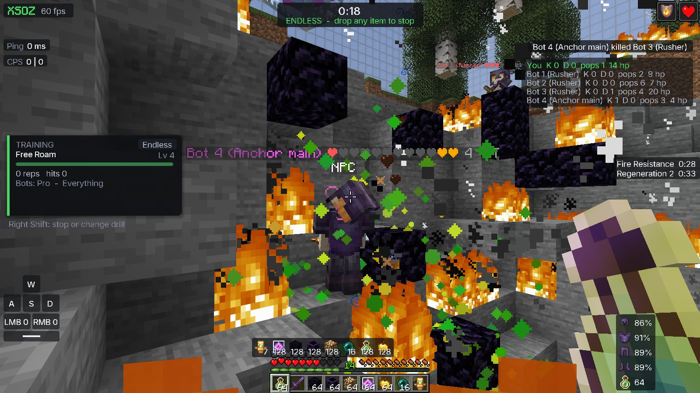

# Xsoz Client

Xsoz Client is a Minecraft 1.21.11 Fabric mod for learning PvP. It is mostly made for Crystal PvP, with some Sword PvP too. (for now. I'll be adding a bunch of other stuff later.) It has lessons, tutorials, drills and bots you can fight. To install it, download the installer from the [releases page](../../releases/latest) and run it.

## Install

1. Download `Xsoz-Client-Setup.exe` from the [latest release](../../releases/latest).
2. Run it. Windows might say "Windows protected your PC" because the file isn't signed. Click More info, then Run anyway.
3. The installer looks for your `.minecraft` folder. If it can't find it, it asks you to pick it. Press Install.
4. Open the normal Minecraft Launcher. Pick "Xsoz Client" in the version list next to the PLAY button, then press PLAY.

You need Minecraft: Java Edition and the official launcher. Xsoz Client runs from its own folder, so your worlds, mods and other versions aren't touched.

## Tutorials

Most lessons in the Learn tab have a "Watch and try" button. The game slows down, the keys being pressed show up on screen, and it pauses at the important parts to explain what happened. After that it resets and you try it yourself.

There are tutorials for placing and breaking crystals, getting your totem back, surrounding, anchors, anchor double tap, crystal double tap, hit crystal, crits, W-tapping and breaking shields. (I'll be adding more soon.)

  
  

  

## Learn

The Learn tab has short lessons split into Basics, Crystal and Sword. Mace and UHC are coming later.

  

## Training

Each drill trains one thing and has 3 levels. When you pass the Level Up test you go up a rank. After every fight you get a grade, what you did wrong, and which drill to do to fix it.

## Free Roam

Free Roam lets you fight bots for as long as you want. You can choose:

- Weapons: crystals, anchors, sword, axe and shield, mace, elytra
- Map: Stone, Grass, Craters, Hills, Ruins, Obsidian, Desert, Birch forest, Snowy taiga, Nether
- Ground: a thin floor, deep ground, or a full world down to bedrock
- Teams: free for all, bots vs you, or bots on your team
- Bot level: Beginner, Casual, Good, Pro, Godlike or Hacker. They can all be the same level, mixed, or Adaptive, which gets harder when you win and easier when you lose.

Bots play by normal player rules. They have 4.5 blocks of reach for blocks and 3 for hits, they can only click what they can see, and they only sprint forward. Better bots follow your pearls. Each bot also has a personality, so some like anchors, some rush you and some sit in holes. Hacker is the only level that cheats.

There is also a watch mode where you fly around and watch the bots fight each other, if you're into that.

  
  

## Mods

It also comes with some small mods: hide explosion particles, zoom, toggle sprint, a cleaner crosshair and a HUD editor. Any other mods you'd like to add directly, you can suggest it in the issues tab.

## DIY

- Mod: `./gradlew :platform-1.21.11:build` (needs JDK 25)
- Installer: `dotnet publish launcher/src/Xsoz.Launcher/Xsoz.Launcher.csproj -c Release` (needs .NET 10, Windows only)

Not an official Minecraft product. Not approved by or associated with Mojang or Microsoft.
